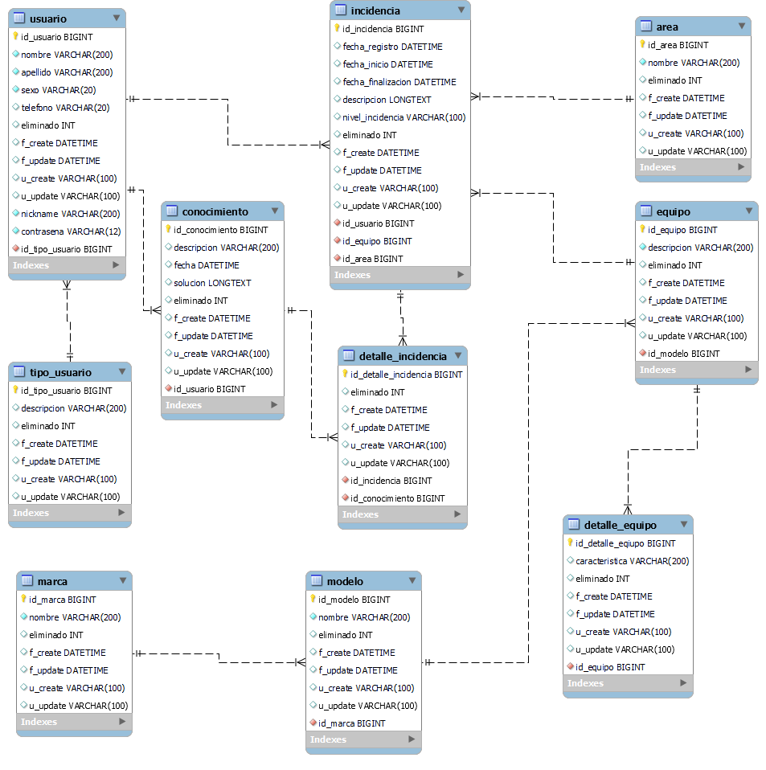

# 📄 About Database Model

For this project, a relational database is being used and an entity relationship model was created with a master detail structure.
  

  

  

# 🚧 Made With

* [Mysql Workbench](https://www.mysql.com/products/workbench/)
* [Mysql](https://www.mysql.com/)

 

# 🔧 Configuration

load the file [New BDD - Incidencia.sql](https://github.com/TrustCodeDev/ApiIncidencias/blob/master/src/bdd/New%20BDD%20-%20Incidencia.sql)  in your favorite database manager, for this case mysql workbench was used.